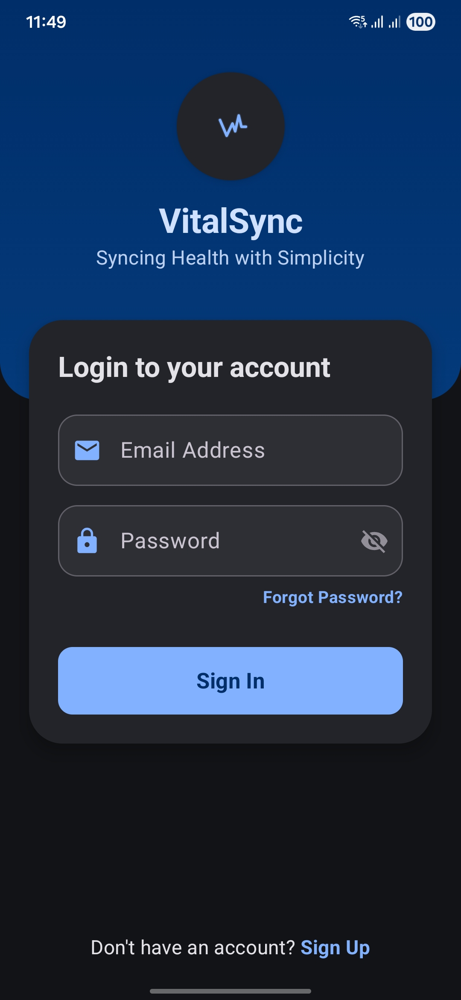
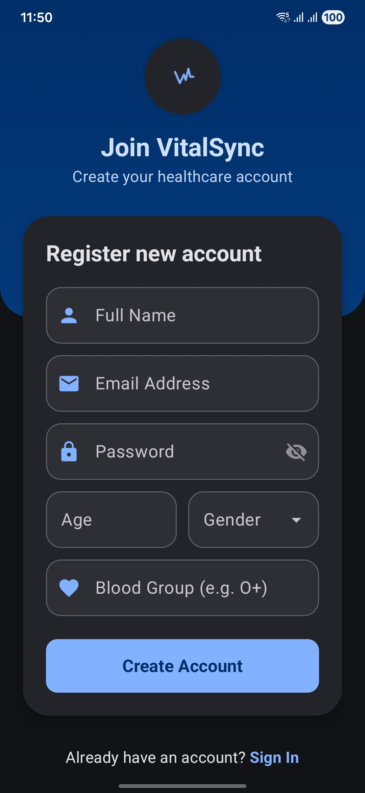
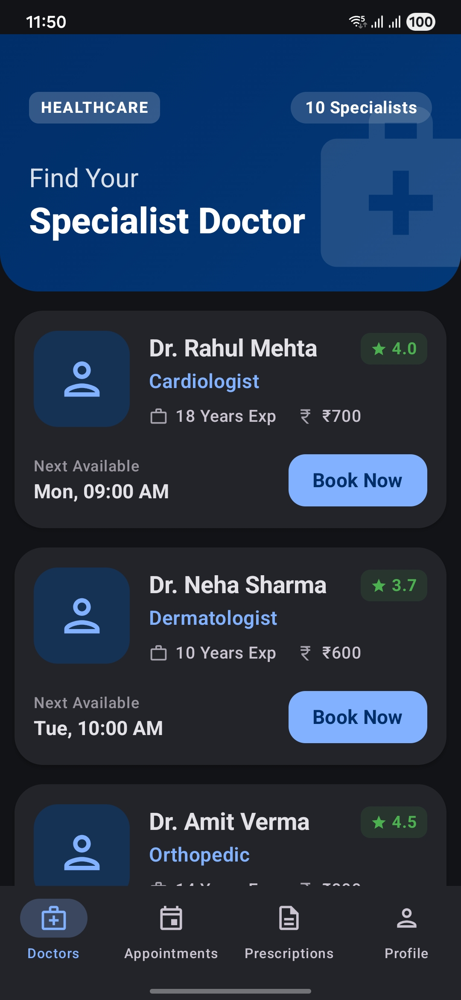
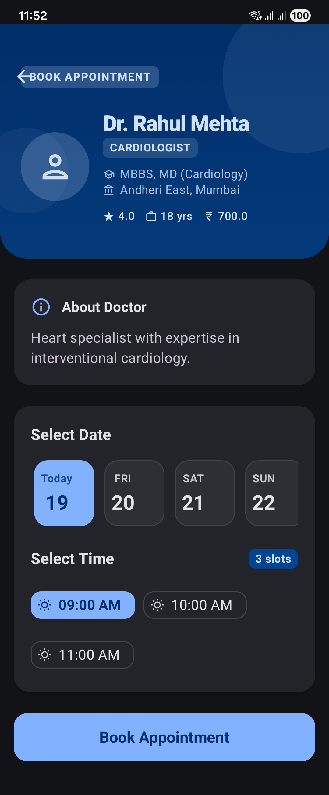
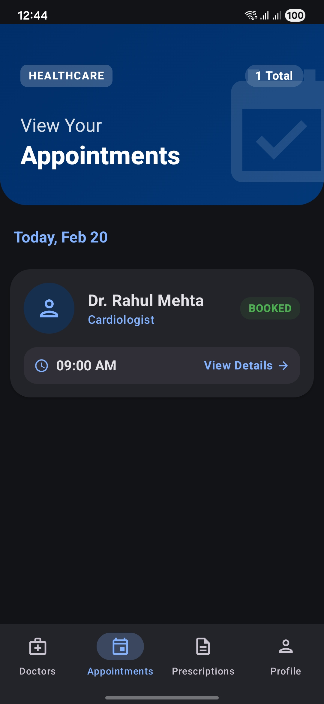
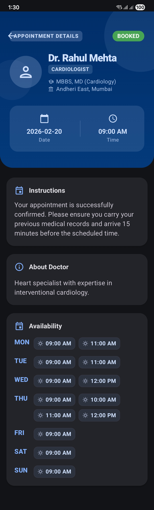
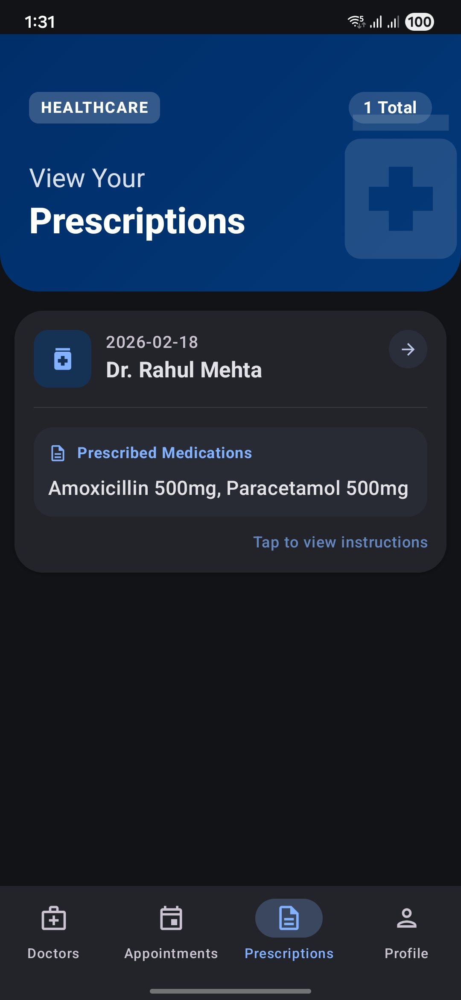
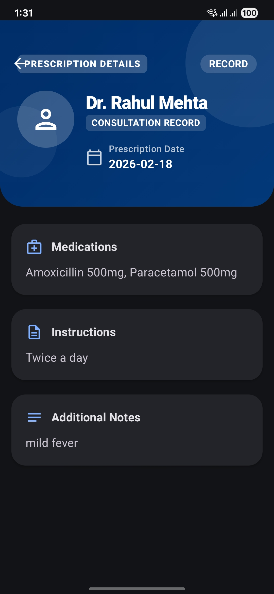
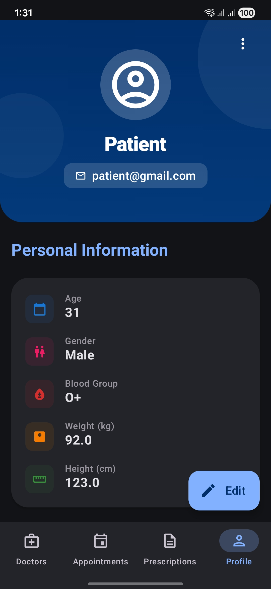

# 🏥 VitalSync - Healthcare Patient App

An elegant, modern, and high-performance Android application designed to bridge the gap between patients and healthcare providers. Built with the latest Android technologies, this app provides a seamless experience for finding specialists, managing appointments, and tracking medical history.

---

## 📸 App Walkthrough

### 🔐 Onboarding
| Login | Registration |
| :---: | :---: |
|  |  |

### 🩺 Find & Book Doctors
| Doctors Discovery | Book Appointment |
| :---: | :---: |
|  |  |

### 📅 Manage Consultations
| My Appointments | Appointment Detail |
| :---: | :---: |
|  |  |

### 📜 Medical Records & Profile
| Prescriptions | Prescription Detail | Profile |
| :---: | :---: | :---: |
|  |  |  |

---

## ✨ Features

- **👨‍⚕️ Doctor Discovery**: Browse a comprehensive list of specialist doctors with detailed profiles, ratings, and experience.
- **📅 Smart Booking**: Interactive appointment scheduling with real-time slot availability mapping.
- **🗓️ Appointment Management**: Keep track of upcoming and past consultations with status updates.
- **📄 Prescription tracking**: Quick access to your medical prescriptions and doctor recommendations.
- **🔐 Secure Access**: JWT-based authentication system ensuring patient data privacy.
- **🌓 Dynamic UI**: Full support for Light and Dark modes with a refined Material 3 design system.

---

## 🚀 Tech Stack

- **UI**: [Jetpack Compose](https://developer.android.com/jetpack/compose) (100% Declarative UI)
- **Design**: [Material 3](https://m3.material.io/) (Modern Components & Theming)
- **Architecture**: MVVM (Model-View-ViewModel) + Clean Architecture principles
- **Asynchronous**: [Kotlin Coroutines](https://kotlinlang.org/docs/coroutines-overview.html) & [StateFlow](https://kotlinlang.org/api/kotlinx.coroutines/kotlinx-coroutines-core/kotlinx.coroutines.flow/-state-flow/)
- **Networking**: [Retrofit](https://square.github.io/retrofit/) + [OkHttp](https://square.github.io/okhttp/)
- **Navigation**: [Navigation Compose](https://developer.android.com/jetpack/compose/navigation)
- **Security**: JWT (JSON Web Tokens) for API authorization

---

## 📂 Project Structure

The project follows a modular and feature-based package structure for high maintainability:

```text
com.patient.app
├── 🔑 login/auth      # Authentication flow & User registration
├── 🏠 dashboard       # Main container & Bottom navigation logic
├── 🩺 doctors         # Doctor listing & Detailed profiles
├── 📅 appointments    # Booking engine & Appointment tracking
├── 📜 prescriptions   # Prescription viewing & management
├── 🧭 navigation      # Centralized routing & Route definitions
├── 🌐 network         # Retrofit services & API DTOs
└── 🛠️ core            # Shared UI components, Theming, & Token management
```

---

## 🛠️ Getting Started

### Prerequisites
- Android Studio Ladybug or newer
- Android SDK 34+
- Local backend server running at `http://10.0.2.2:8080` (for emulator)

### Installation
1. Clone the repository:
   ```bash
   git clone https://github.com/your-repo/healthcare-patient-app.git
   ```
2. Open the project in Android Studio.
3. Sync Project with Gradle Files.
4. Run the app on an Emulator or Physical Device.

---

## 🎨 Design Language

The app utilizes a sophisticated color palette and component library to provide a professional healthcare feel:
- **Primary Colors**: Deep Healthcare Blues & Trust Greens.
- **Components**: Rounded cards, filter chips, and interactive surfaces.
- **UX**: Optimized for single-handed use with intuitive bottom navigation.

---

## 🌐 API Reference

The app communicates with a RESTful API. Key endpoints include:
- `POST /auth/login` - User authentication
- `GET /doctors` - Paginated doctor list
- `GET /doctors/{id}` - Comprehensive doctor details
- `POST /appointments` - Book a new session

---

Developed with ❤️ for a better healthcare experience.
